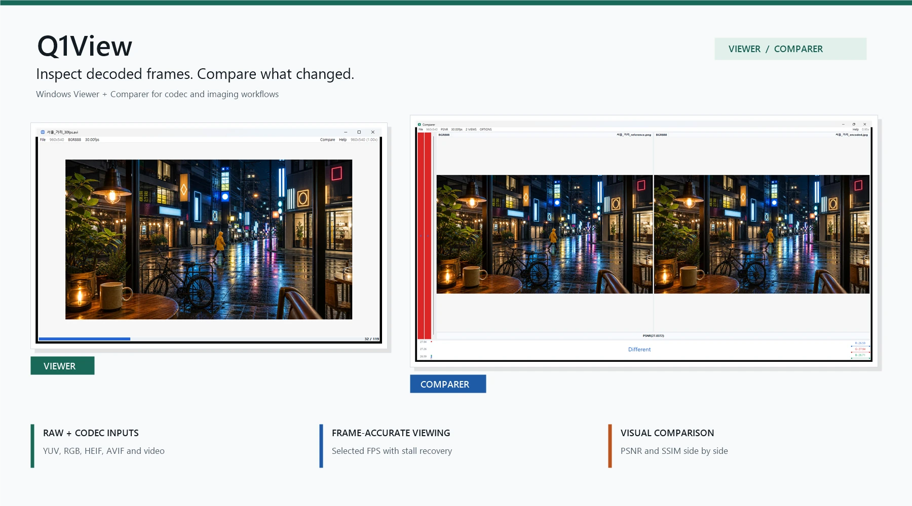
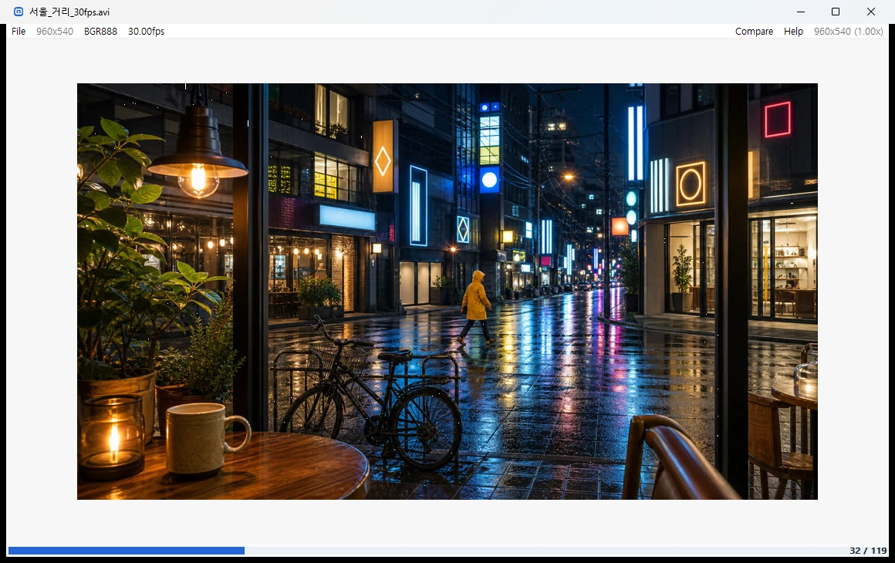
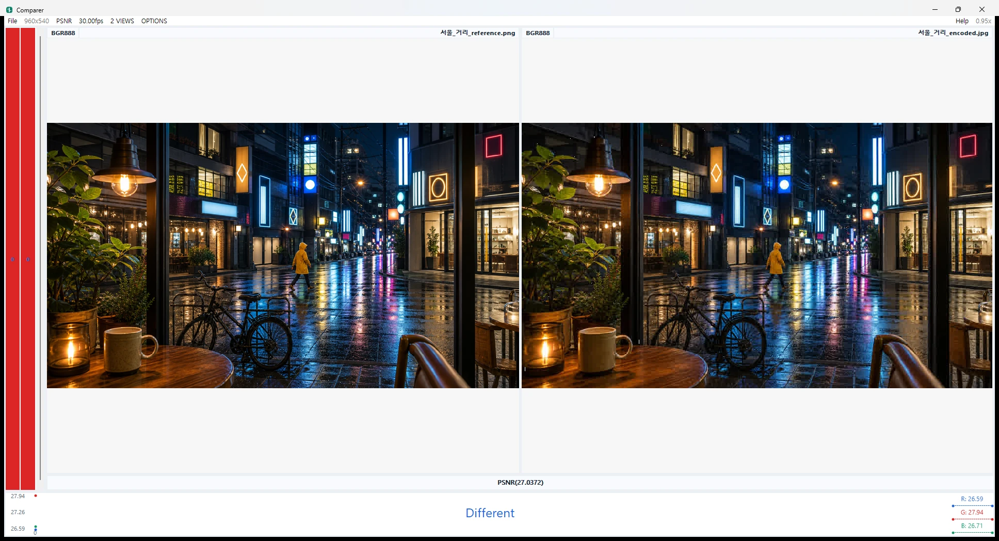

# Q1View

[](#download)
[](#applications)
[](#applications)
[](#supported-inputs)
[](#supported-inputs)



**Q1View** is a Windows Viewer and Comparer for inspecting decoded frames,
raw pixel buffers, image codec output, and small visual differences that are
easy to miss in a general-purpose media player.

[Download the latest release](https://github.com/chammoru/Q1View/releases/latest)
| [User guide](docs/USER_GUIDE.md)
| [Development guide](docs/DEVELOPMENT.md)

## Why Q1View?

- **Inspect real pixel data.** Raw YUV and RGB formats sit beside regular
  images, HEIF/HEIC, AVIF, and video input.
- **Compare output, not impressions.** Comparer places 2-4 sources together
  with synchronized inspection and PSNR/SSIM measurement.
- **Check video timing.** Viewer follows the source or selected frame rate and
  catches up after temporary stalls rather than drifting behind.
- **Work with practical test material.** Korean/Unicode paths, frame
  sequences, clipboard images, and linked Viewer controls are supported.

Q1View is not intended to manage photo libraries or replace a consumer video
player. It is focused on codec development, imaging validation, and quick
frame-level investigation.

## Applications

### Viewer

Open an image, raw dump, sequence, or video; zoom down to pixels, inspect
coordinates and values, step through frames, or link multiple Viewer windows.



### Comparer

Open two to four sources side by side and see a visual difference together with
objective similarity measurements.



## Download

Get the latest Windows x64 build from the
[GitHub Releases page](https://github.com/chammoru/Q1View/releases/latest).

- **Installer**: `Q1ViewSetup-x64.exe`
- **Portable package**: `Q1View-windows-x64.zip`

The installer registers separate Start Menu entries for **Q1View Viewer** and
**Q1View Comparer**.

## Supported Inputs

- BMP, JPEG, PNG, TIFF, WebP
- HEIF, HEIC, HIF
- AVIF / AV1 still images
- Video files supported by the packaged OpenCV/FFmpeg runtime
- Raw frame dumps and clipboard images

## Documentation

- [User Guide](docs/USER_GUIDE.md): screens, workflows, menus, and shortcuts
- [Development Guide](docs/DEVELOPMENT.md): local build and release packaging
- [HEIF and AVIF Support](docs/HEIF_SUPPORT.md): decoder dependency details

## Build

Q1View builds with Visual Studio 2019 or newer on Windows x64.

```powershell
msbuild Viewer\Viewer.sln /m /restore /p:Configuration=Release /p:Platform=x64
msbuild Comparer\Comparer.sln /m /restore /p:Configuration=Release /p:Platform=x64
```

See the [Development Guide](docs/DEVELOPMENT.md) for dependencies, packaging,
and release assets.

## Videos

| Intro | Viewer | Comparer |
| --- | --- | --- |
| [](https://youtu.be/b8VgRVnrxL4) | [](https://youtu.be/g6K9bRTKJjY) | [](https://youtu.be/EybIIBZLV8Q) |
