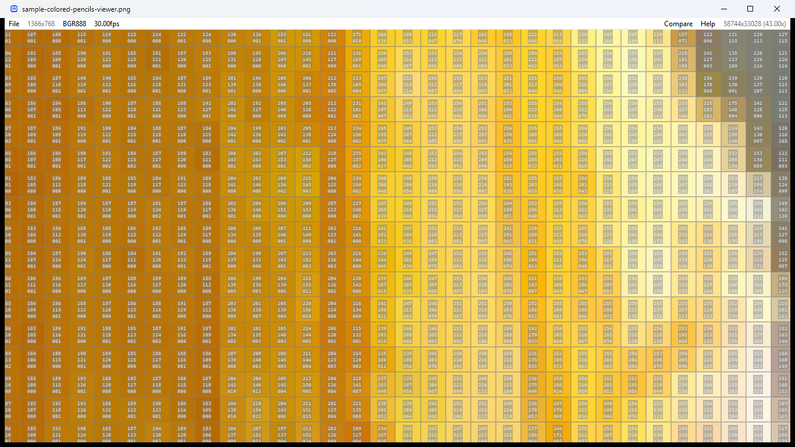
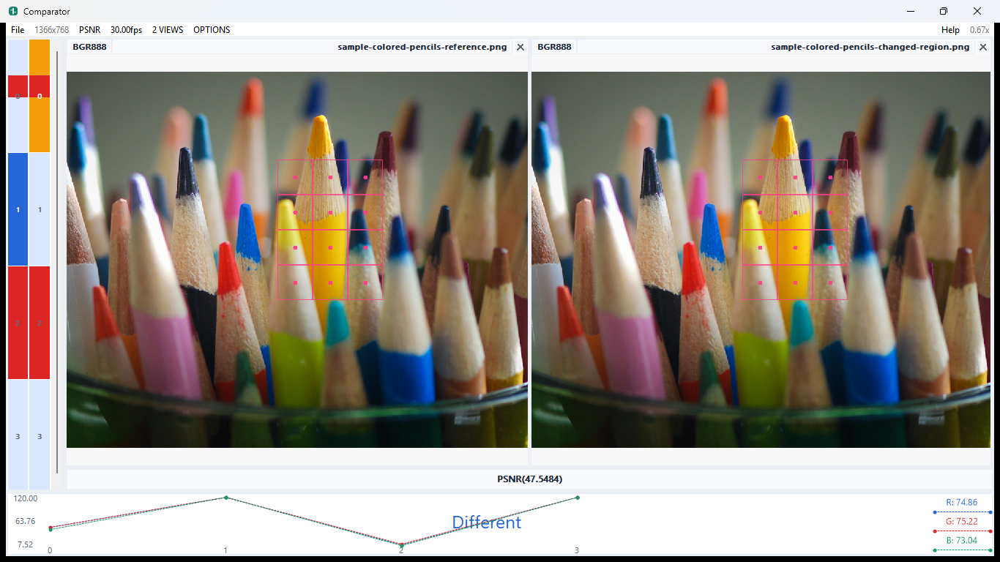

# Q1View User Guide

Q1View contains two focused Windows applications: **Viewer** for inspecting a
single source and **Comparator** for measuring differences between sources.

## Viewer

Viewer opens regular images, raw frame dumps, image sequences, videos, and
clipboard images. The top bar reports resolution, interpreted color space, and
frame rate; high zoom reveals per-pixel component values.

### Typical Workflow

1. Open or drag a source into Viewer.
2. Use the mouse wheel to examine edges and individual pixels.
3. Use `C`, `B`, `Y`, `H`, or `I` to adjust inspection overlays and display.
4. For video, use `Space`, arrow keys, the timeline, and the FPS menu.
5. Select **Compare** to move a source into comparison work.

Video playback follows the source FPS or the FPS chosen in the menu. If display
or decode work briefly falls behind, Viewer drops late presentation frames to
return to the media timeline.

When a raw YUV source is zoomed far enough to show pixel values, Viewer shows
source-native `Y`, `U`, and `V` values by default. They are sampled from the
planes in the selected raw layout, including subsampled and 10-bit formats,
rather than reconstructed from the displayed RGB image. Press `V` to toggle
between source YUV values and displayed RGB values. A small corner badge
identifies the active pixel-value mode and row order (`Y/U/V` or `R/G/B`)
without adding labels to every pixel.
Decoded images and video show RGB values only.

### Controls

Viewer includes a built-in control panel, opened with `?`.

| Action | Control |
| --- | --- |
| Open a file | Drag and drop or `Ctrl+O` |
| Toggle thumbnail browser (drawer) | `E` |
| Paste image from clipboard | `Ctrl+V` |
| Zoom | Mouse wheel |
| Full screen | `Return` |
| Play or pause video | `Space` |
| Previous or next frame | Left / Right |
| First or last frame | Home / End |
| Previous or next file | Page Up / Page Down |
| Toggle luma-only view | `Y` |
| Toggle RGB / source YUV pixel values | `V` |
| Toggle hex pixel values | `H` |
| Rotate clockwise | `R` |
| Toggle pixel coordinates | `C` |
| Toggle box info display | `B` |
| Toggle pixel interpolation | `I` |
| Next color space | `N` |
| Mute or unmute video audio | `M` |
| Toggle selection mode | `S` |
| Capture view or selected region | `Ctrl+C` |

### Thumbnail Browser

Press `E` (or **File ▸ Thumbnail Browser**) to slide out a thumbnail drawer on
the right. It is hidden by default, so the window is unchanged until you open
it. The drawer is a small explorer for the current file's folder: a `..` entry
and sub-folders let you browse with a double-click, and the supported image and
raw files are listed with thumbnails (raw formats show a labeled placeholder).
Double-click an image to open it in the main view. The drawer's visibility is
remembered between sessions.

### Synchronized Viewer Windows

To inspect related sources interactively, open more than one Viewer window,
right-click each image area, and enable **Sync Input**. Navigation, zoom, pan,
rotation, playback, FPS, and display mode changes are relayed between enabled
Viewer windows.

## Comparator

Comparator opens two to four images, raw dumps, or video/frame sources in aligned
panes. The header controls the interpreted resolution, metric, FPS, view count,
and options.

### Typical Workflow

1. Open multiple files together or drop a source into each pane.
2. Select **PSNR** or **SSIM** from the metric menu.
3. Zoom and navigate the sources in a common view.
4. Use the bottom graph and channel values to find meaningful differences.
5. Enable **Allow Different Resolution** from **OPTIONS** when required.

The same reference and encoded image can also be reviewed with SSIM selected.

### Pixel-Level Diff Overlay

When two sources are loaded, Comparator highlights every region where the pixels
differ from the reference pane. The image area is divided into a fixed-size
grid in display pixels; each cell that contains any differing pixel gets a
translucent pink rectangle outline plus a center dot. Because the cell size is
fixed on screen, zooming in implicitly subdivides the source area each cell
covers — at maximum zoom each dot resolves to a single differing source pixel.
The overlay is hidden automatically when zoom is high enough to show per-pixel
values, since the pixel labels already convey the diff.

### Pane Layout

Three secondary panes sit around the image canvases and surface per-frame and
across-frame comparison information.

- **Position timeline (left column).** A vertical strip that lists every frame
  in the active pair, top to bottom. Frames where the two panes differ are
  marked with a red line; identical frames are blank. Click a row to seek both
  panes to that frame. The currently shown frame is highlighted so it is easy
  to find your place after scrolling. Space, Left, and Right are also routed
  here, so the timeline owns playback control once it has been clicked.
- **Per-frame metric text (between the timeline and the graph).** Shows the
  metric value (PSNR or SSIM, whichever is selected in the header) for the
  currently displayed frame pair, along with auxiliary numbers such as channel
  breakdowns where the metric provides them. The label updates whenever either
  pane changes frames or the metric selection changes.
- **Metric-over-time graph (bottom strip).** Plots the same metric value across
  every frame in the comparison, with the running average alongside. The
  current frame is marked. Click a point on the graph to jump both panes to
  that frame, mouse-wheel to zoom the horizontal axis, and double-click to
  reset the zoom. Playback shortcuts work here as well once the graph has
  focus.

### Controls

Comparator also includes a built-in shortcut panel, opened with `?`.

| Action | Control |
| --- | --- |
| Show or hide the shortcut panel | `?` |
| Open a source in a pane | Drag and drop |
| Zoom | Mouse wheel |
| Previous or next video frame | Left / Right |
| Play or pause | `Space` |
| Toggle hex pixel values | `H` |
| Toggle pixel interpolation | `I` |
| Toggle pink diff overlay (grid + dots) | `D` |
| Toggle cursor pixel coordinates | `C` |
| Seek to a frame in the timeline (video) | Click left or right side |

## Input Notes

- HEIF/HEIC/HIF and AVIF still images are supported by both applications.
- Linear YUV raw inputs support odd dimensions such as `321x241`, with the
  resolution and color-space token supplied in the file name.
- The portable package and installer include the required runtime libraries.
- Unicode paths are supported, including Korean file and directory names.
- Video decoding depends on the codecs supported by the bundled OpenCV/FFmpeg
  runtime.
