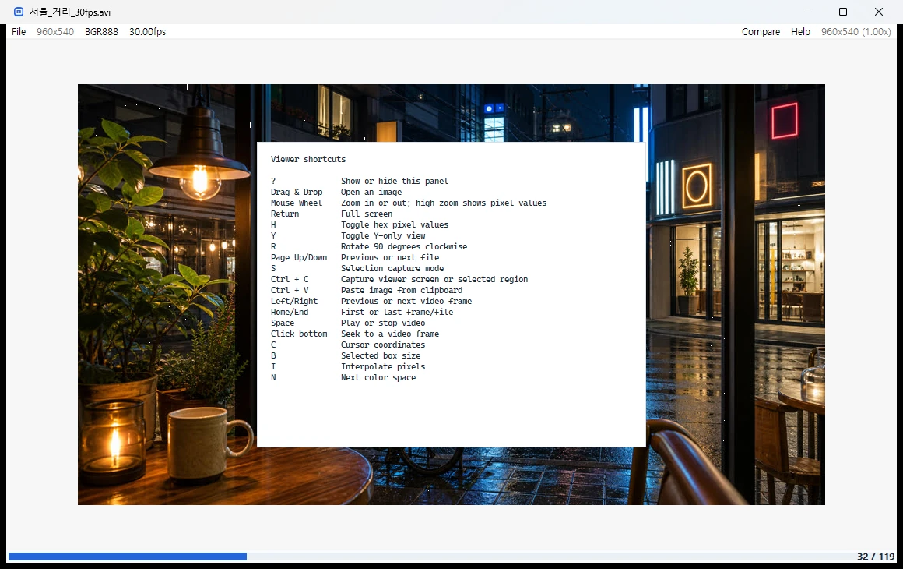
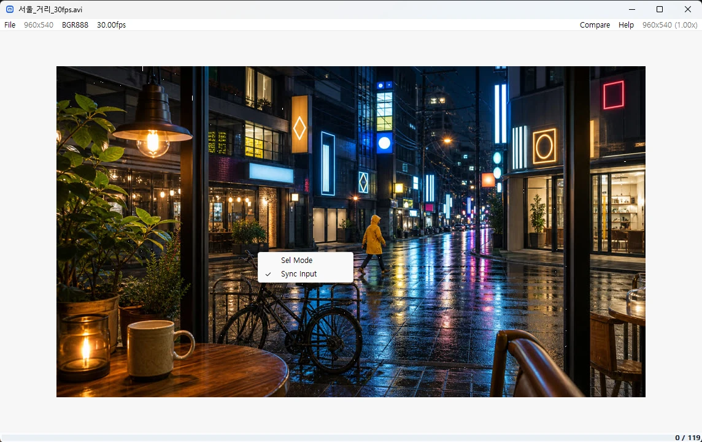
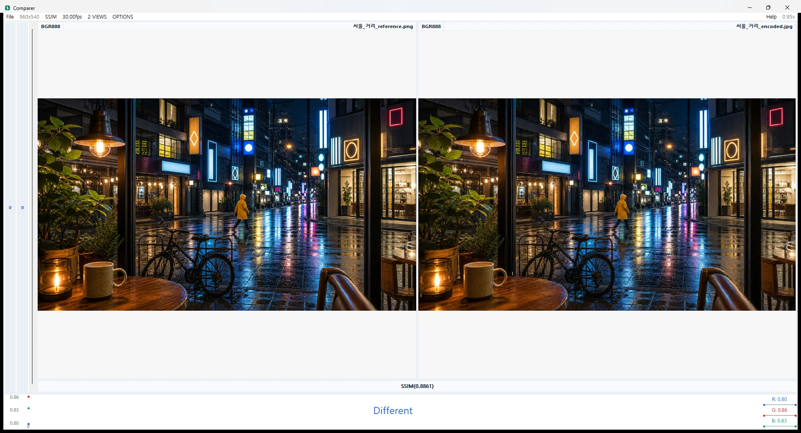

# Q1View User Guide

Q1View contains two focused Windows applications: **Viewer** for inspecting a
single source and **Comparer** for measuring differences between sources.

## Viewer

Viewer opens regular images, raw frame dumps, image sequences, videos, and
clipboard images. The top bar reports resolution, interpreted color space, and
frame rate; videos add a seek timeline at the bottom.

### Typical Workflow

1. Open or drag a source into Viewer.
2. Use the mouse wheel to examine edges and individual pixels.
3. Use `C`, `B`, `Y`, `H`, or `I` to adjust inspection overlays and display.
4. For video, use `Space`, arrow keys, the timeline, and the FPS menu.
5. Select **Compare** to move a source into comparison work.

Video playback follows the source FPS or the FPS chosen in the menu. If display
or decode work briefly falls behind, Viewer drops late presentation frames to
return to the media timeline.

### Controls

Viewer includes a built-in control panel, opened with `?`.

| Action | Control |
| --- | --- |
| Open a file | Drag and drop or `Ctrl+O` |
| Zoom | Mouse wheel |
| Full screen | `Return` |
| Play or pause video | `Space` |
| Previous or next frame | Left / Right |
| First or last frame | Home / End |
| Toggle luma-only view | `Y` |
| Rotate clockwise | `R` |
| Toggle pixel coordinates | `C` |
| Toggle selection mode | `S` |
| Capture view or selected region | `Ctrl+C` |

### Synchronized Viewer Windows

To inspect related sources interactively, open more than one Viewer window,
right-click each image area, and enable **Sync Input**. Navigation, zoom, pan,
rotation, playback, FPS, and display mode changes are relayed between enabled
Viewer windows.

## Comparer

Comparer opens two to four images, raw dumps, or video/frame sources in aligned
panes. The header controls the interpreted resolution, metric, FPS, view count,
and options.

### Typical Workflow

1. Open multiple files together or drop a source into each pane.
2. Select **PSNR** or **SSIM** from the metric menu.
3. Zoom and navigate the sources in a common view.
4. Use the bottom graph and channel values to find meaningful differences.
5. Enable **Allow Different Resolution** from **OPTIONS** when required.

The same reference and encoded image below are shown with SSIM selected:

## Input Notes

- HEIF/HEIC/HIF and AVIF still images are supported by both applications.
- The portable package and installer include the required runtime libraries.
- Unicode paths are supported, including Korean file and directory names.
- Video decoding depends on the codecs supported by the bundled OpenCV/FFmpeg
  runtime.
